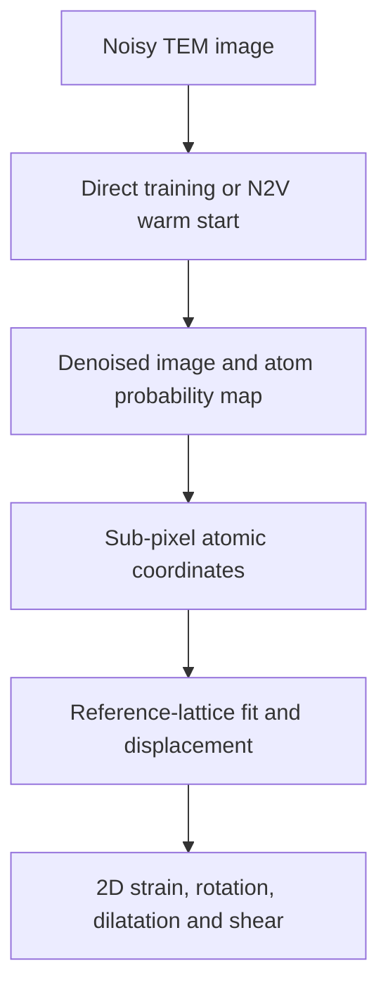
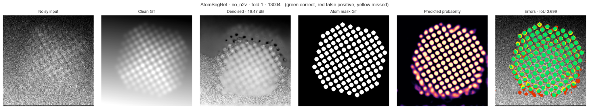

# Deep Learning for Quantitative TEM

**Atomic-column localization, lattice metrology, strain mapping, and simulation-to-experiment transfer.**

This project asks a microscopy question rather than a leaderboard question:

> **Can denoising and deep-learning segmentation improve quantitative atomic measurements in noisy TEM, or do they only make the images look cleaner?**

The workflow compares **AtomSegNet, U-Net++ and HRNet**, trained either directly or after a self-supervised **Noise2Void (N2V)** warm start. Network outputs are not treated as the endpoint. Predicted atomic-column probability maps are converted into **sub-pixel coordinates, lattice parameters, displacement fields, 2D strain tensors, rotation, dilatation and shear**.





> **Results snapshot: 12 September 2026.** The six architecture-condition groups have now completed all five folds: **30/30 model-fold combinations**.

## Research design

- **14,364 paired simulated TEM frames** from the development portion of TEM-ImageNet-v1.3, processed as 256 x 256 px images
- **5-fold cross-validation**
- **3 architectures:** AtomSegNet, U-Net++ and HRNet
- **2 conditions:** direct training (`no_n2v`) and N2V-initialized training (`with_n2v`)
- **30 complete model-fold combinations:** 3 architectures x 2 conditions x 5 folds
- approximately **9.1 million parameters** per architecture
- controlled translation tests using **6 base images, 15 shifted variants per image and every model-fold combination**
- downstream lattice and strain pilot on **4 images from no-N2V fold 1**
- transfer screening of **57 unlabeled experimental TEM images**, of which 28 passed the lattice-quality criteria

Training and evaluation used CUDA-capable NVIDIA hardware locally and on the IIT Jodhpur HPC system. All model-level values below are reported as **mean ± sample standard deviation over five folds**, unless stated otherwise.

## Main findings

### 1. The complete benchmark has different winners for denoising and segmentation

| Condition | Architecture | Parameters (M) | PSNR (dB) | SSIM | IoU | PSNR gain vs Gaussian (dB) |
|---|---|---:|---:|---:|---:|---:|
| No N2V | AtomSegNet | 9.12 | 27.84 ± 0.21 | 0.869 ± 0.003 | **0.824 ± 0.002** | +3.48 |
| No N2V | HRNet | 9.18 | **28.12 ± 0.29** | **0.877 ± 0.020** | 0.812 ± 0.002 | **+3.75** |
| No N2V | U-Net++ | 9.12 | 18.68 ± 7.71 | 0.635 ± 0.201 | 0.798 ± 0.010 | -5.68 |
| With N2V | AtomSegNet | 9.12 | 25.89 ± 0.12 | 0.833 ± 0.002 | 0.792 ± 0.001 | +1.53 |
| With N2V | HRNet | 9.18 | 21.12 ± 1.46 | 0.758 ± 0.038 | 0.773 ± 0.003 | -3.24 |
| With N2V | U-Net++ | 9.12 | 16.02 ± 6.49 | 0.569 ± 0.176 | 0.806 ± 0.015 | -8.34 |

The Gaussian-blur reference was approximately **24.36 dB PSNR**. The complete results support three distinct conclusions:

- **AtomSegNet without N2V is the strongest segmentation configuration**, with IoU `0.824 ± 0.002`.
- **HRNet without N2V is the strongest conventional denoiser**, with PSNR `28.12 ± 0.29 dB` and SSIM `0.877 ± 0.020`.
- High image-restoration scores and high segmentation scores are related but are **not interchangeable measures**.

Paired comparisons over the five no-N2V folds showed that AtomSegNet exceeded HRNet by `0.0121 ± 0.0013` IoU (**5/5 fold wins, p < 0.001**) and U-Net++ by `0.0254 ± 0.0096` IoU (**5/5 wins, p = 0.004**).

Under N2V initialization, U-Net++ had the highest numerical mean IoU (`0.806`), but its advantage over AtomSegNet was not statistically resolved across five folds (`ΔIoU = 0.0143 ± 0.0142`, 4/5 wins, `p = 0.088`). It exceeded HRNet by `0.0334 ± 0.0146` IoU (5/5 wins, `p = 0.007`).

The U-Net++ denoising head was unstable in both conditions. Its worst no-N2V folds reached only **13.04 dB**, while its worst N2V folds reached **11.65 and 13.41 dB**. N2V-initialized HRNet was also less stable and fell below the Gaussian baseline on average. These failures explain why a favorable single example can look convincing even when the cross-fold denoising result is poor.

### 2. AtomSegNet gives the strongest reference-matched atomic localization

Across the five no-N2V AtomSegNet folds:

| Metric | Result |
|---|---:|
| Segmentation IoU | **0.824 ± 0.002** |
| Atomic-site F1 | **0.929 ± 0.010** |
| Precision | 0.897 |
| Recall | **0.963** |
| Reference-matched coordinate RMSE | **1.128 ± 0.034 px** |

The F1 score measures whether atomic sites were detected. The coordinate RMSE measures their distance from simulated reference positions. It is an **absolute-accuracy measurement on simulated data**, not the same quantity as the translation-repeatability test below.

### 3. N2V trades segmentation accuracy and coverage for conditional coordinate repeatability

Translation-equivariance was evaluated for all **30 model-fold combinations**. Each combination used six base images and 15 translated variants per image. After compensating for the known image translation, coordinates belonging to the same atomic columns were matched and compared.

| Condition | Architecture | Shift-pair RMSE (px) | Equivalent per-image repeatability (px) | Match rate |
|---|---|---:|---:|---:|
| No N2V | AtomSegNet | 0.976 ± 0.164 | 0.690 ± 0.116 | 0.851 ± 0.102 |
| No N2V | HRNet | 0.931 ± 0.141 | 0.658 ± 0.100 | 0.852 ± 0.067 |
| No N2V | U-Net++ | **0.717 ± 0.065** | **0.507 ± 0.046** | **0.887 ± 0.064** |
| With N2V | AtomSegNet | **0.717 ± 0.061** | **0.507 ± 0.043** | 0.824 ± 0.088 |
| With N2V | HRNet | 0.763 ± 0.070 | 0.539 ± 0.049 | 0.787 ± 0.135 |
| With N2V | U-Net++ | 0.776 ± 0.098 | 0.549 ± 0.069 | 0.872 ± 0.083 |

The directly measured quantity is the **shift-pair RMSE**. The equivalent per-image value is calculated as:

```text
equivalent per-image repeatability = pair RMSE / sqrt(2)
```

This conversion assumes that the two localization errors are independent and have equal variance. Because the shifted variants originate from the same base image, the per-image value should be treated as an **estimated repeatability**, not a directly measured localization accuracy.

For AtomSegNet, N2V changed the results in opposite directions:

- segmentation IoU decreased from **0.824 to 0.792**;
- reference-matched localization RMSE increased from approximately **1.13 to 1.24 px**;
- shift-pair RMSE improved from **0.976 to 0.717 px**;
- estimated per-image repeatability improved from **0.690 to 0.507 px**;
- match rate decreased from **0.851 to 0.824**.

N2V also improved HRNet's repeatability (`0.658` to `0.539 px`) but slightly worsened U-Net++ (`0.507` to `0.549 px`). The defensible conclusion is therefore not that N2V universally helps or hurts. Instead, **N2V can stabilize the coordinates that remain successfully matched while reducing segmentation accuracy or matching coverage**.

U-Net++ without N2V is particularly instructive: it produced unstable denoising PSNR but excellent shift repeatability. This directly demonstrates why visual quality, PSNR, segmentation overlap and coordinate metrology must be evaluated separately.


### 4. Atomic coordinates can be propagated into lattice and strain measurements

Predicted coordinates are fitted to a reference lattice and converted into displacement and local strain fields. The current quantitative strain pilot covers **four images from no-N2V fold 1**; it is not yet a cross-fold strain benchmark.

| Architecture | Valid-strain fraction | Lattice-inlier fraction | Normalized lattice RMSE | Displacement RMS (px) | Median local-fit residual (px) |
|---|---:|---:|---:|---:|---:|
| AtomSegNet | **0.8743** | 0.9067 | **0.03770** | **0.6705** | **0.5553** |
| HRNet | 0.7898 | 0.8244 | 0.03922 | 0.7222 | 0.5838 |
| U-Net++ | 0.8613 | **0.9298** | 0.04489 | 0.8393 | 0.6173 |

AtomSegNet gives the most balanced result in this pilot: the highest valid-strain fraction, lowest normalized lattice residual, lowest displacement RMS and lowest local-fit residual. U-Net++ retains the largest fraction of lattice inliers, showing again that no single diagnostic should be interpreted in isolation.

The median strain-component spreads for AtomSegNet were `sigma(exx) = 0.00959`, `sigma(eyy) = 0.01543` and `sigma(exy) = 0.00644`. These are **spreads in the inferred strain field**, not errors against a known strain ground truth. Until known displacement/strain fields are evaluated across more images and folds, the maps demonstrate end-to-end pipeline operation rather than calibrated strain accuracy.

The analysed examples have approximately equal lattice spacings and cell angles near 90 degrees. Consequently, a fourfold/tetratic orientational-order parameter (`|psi_4|`) is appropriate for these near-square lattices. Exploratory sixfold/hexatic (`|psi_6|`) values are not used in the benchmark conclusions.


### 5. Simulation-to-experiment transfer preserves periodic structure but is not calibrated segmentation

The experimental archive contained **57 unlabeled TEM images**. Objective FFT/lattice-quality screening excluded 29 images for which a reliable lattice period or scale match could not be established, leaving **28 analyzable images**.

The current transfer snapshot was generated before completion of the final six benchmark checkpoints and therefore applies **24 trained checkpoints to the 28 retained experimental images**. It should be rerun with all 30 completed checkpoints for the final manuscript analysis.

The outputs were spatially structured and generally followed bright image features. An identifiable **lattice-frequency FFT peak was retained in approximately 85% of model-image pairs**. This means that periodic information present in the experimental image remained detectable after inference. It does **not** mean 85% atom-detection accuracy.

Predicted foreground coverage ranged from **0.102 to 0.984**, compared with approximately **0.137 in the simulated training domain**. The simulated probability threshold of `0.5` therefore does not transfer reliably to every experimental image.

The real-image outputs must currently be interpreted as **candidate atomic-feature probability maps with model disagreement**, not validated experimental atom masks or ground-truth strain measurements.


## Why the qualitative outputs can look identical

Sample `01948` is an easy example containing 12 isolated, high-contrast atomic columns. All six configurations recover essentially the same topology, with IoU values between `0.928` and `0.963`. Most disagreements occupy only a one-pixel boundary around each predicted disk and disappear when the full 256 x 256 montage is downscaled.

| Configuration shown for sample 01948 | PSNR (dB) | IoU |
|---|---:|---:|
| AtomSegNet with N2V | 30.77 | 0.947 |
| AtomSegNet without N2V | 33.43 | 0.963 |
| U-Net++ with N2V | 33.88 | 0.957 |
| U-Net++ without N2V | 33.96 | 0.954 |
| HRNet with N2V | 28.50 | 0.928 |
| HRNet without N2V | 35.20 | 0.941 |

These screenshots use different fold checkpoints and are **illustrative rather than a controlled architecture comparison**. A fair qualitative comparison should use the same fixed external image and fold, common intensity limits, enlarged crops, residual maps and coordinate-error overlays.

The lack of an obvious visual difference does not invalidate the numerical benchmark. It demonstrates the project's central motivation: **similar-looking TEM reconstructions can yield measurably different segmentation boundaries and sub-pixel coordinates**.

## Why this matters for quantitative TEM

The project separates quantities that are often collapsed into one image-quality score:

1. **Denoising quality:** how closely does the reconstructed intensity match the simulated clean image?
2. **Segmentation quality:** does the predicted atomic-column mask overlap the simulated target?
3. **Detection quality:** are the expected atomic sites found without false or missed detections?
4. **Absolute positional accuracy:** how close is each inferred coordinate to the simulated reference coordinate?
5. **Translation repeatability:** does the same atom return to the same physical coordinate after a known image translation?
6. **Downstream metrology:** are the coordinates sufficiently stable for lattice fitting, displacement analysis and strain reconstruction?
7. **Experimental transfer:** does the learned representation preserve real periodic structure outside the simulated training domain?

A visually smoother image can score well in PSNR while producing inferior atom masks, or produce stable coordinates only for the subset of atoms that remain matched. Quantitative microscopy therefore requires task-specific validation beyond visual inspection.

## What can and cannot currently be claimed

Supported by the completed results:

- all six architecture-condition groups completed five-fold evaluation;
- AtomSegNet without N2V has the highest overall mean segmentation IoU;
- HRNet without N2V has the highest mean PSNR and SSIM;
- no-N2V AtomSegNet achieved atomic-site F1 `0.929 ± 0.010` and reference-matched coordinate RMSE `1.128 ± 0.034 px`;
- N2V creates a measurable trade-off between segmentation/coverage and conditional translation repeatability;
- the coordinate-to-lattice-to-strain pipeline runs end to end;
- the screened experimental outputs often preserve detectable lattice-frequency structure.

Not yet supported:

- treating `0.507 px` repeatability as absolute localization accuracy;
- claiming one architecture is best for every stage of the pipeline;
- claiming cross-fold or experimentally validated strain accuracy from the four-image fold-1 pilot;
- interpreting the 85% FFT-retention rate as experimental segmentation accuracy;
- treating thresholded predictions on unlabeled experimental images as ground truth;
- including an unfinished transformer model in the completed benchmark ranking.

## Current benchmark status

| Condition | Architecture | Completed folds |
|---|---|---:|
| No N2V | AtomSegNet | **5/5** |
| No N2V | HRNet | **5/5** |
| No N2V | U-Net++ | **5/5** |
| With N2V | AtomSegNet | **5/5** |
| With N2V | HRNet | **5/5** |
| With N2V | U-Net++ | **5/5** |

See [`results/reports/final_report.md`](results/reports/final_report.md) for the machine-generated report and detailed diagnostics.

## Repository structure

| Path | Purpose |
|---|---|
| `notebooks/TEM_quantitative_pipeline.ipynb` | End-to-end analysis notebook |
| `scripts/check_dataset.py` | Dataset-layout and integrity checks |
| `data/README.md` | Local-data instructions |
| `results/reports/` | Generated benchmark reports |
| `results/benchmark/` | Denoising and segmentation summaries |
| `results/localization/` | Detection, coordinate-error and shift-test outputs |
| `results/strain/` | Lattice, displacement and strain diagnostics |
| `results/transfer/` | Experimental-domain transfer diagnostics |
| `docs/` | Detailed methods and reproducibility notes |
| `assets/` | Curated README and presentation figures |
| `requirements.txt`, `environment.yml` | Reproducible software environments |

Large raw arrays, checkpoints, datasets, caches and multi-megabyte per-atom/per-pair tables are intentionally excluded from normal repository browsing. The curated `results/` directory contains the principal summaries, figures and machine-generated report.

## Dataset

The simulated benchmark uses **TEM-ImageNet-v1.3**:

https://github.com/xinhuolin/TEM-ImageNet-v1.3

Expected subdirectories beneath `data/TEM-ImageNet-v1.3/` are `image/`,
`noNoise/`, `circularMask/`, `gaussianMask/` and `position/`.

`position/` contains lattice vectors rather than per-atom XY coordinates, so localization references are extracted from `gaussianMask/` in the present evaluation pipeline.

The dataset contains a separate 1,437-frame test partition, but the headline tables above report the five-fold development-set benchmark unless explicitly stated otherwise. The experimental TEM images are not distributed in this repository.

## Quick start

```bash
python -m venv .venv

# Linux / macOS
source .venv/bin/activate

# Windows PowerShell
# .venv\Scripts\Activate.ps1

pip install -r requirements.txt
python scripts/check_dataset.py
jupyter lab notebooks/TEM_quantitative_pipeline.ipynb
```

The full training benchmark requires a CUDA-capable NVIDIA GPU. CPU execution is appropriate for code inspection and lightweight diagnostics, not practical retraining of all folds.

## Reproducibility and limitations

- Headline benchmark values come from held-out CV validation splits rather than a final untouched-test-set analysis.
- Filename-level simulation series may contain related sibling frames; a future group-level split is needed to eliminate possible family leakage.
- N2V pretraining used noisy images without labels and is transductive with respect to later validation images.
- U-Net++ denoising was unstable in both conditions, and N2V-initialized HRNet also underperformed the Gaussian baseline on average.
- The 15 translated variants for each frame originate from the same six base images; the derived per-image repeatability therefore depends on the equal, independent-error approximation.
- Strain diagnostics currently cover four images from only one fold and do not include a known strain-field error benchmark.
- No verified physical pixel calibration was supplied, so spatial results are reported in **pixels**.
- Experimental images are unlabeled and quality-screened, so transfer values are diagnostics rather than accuracy measurements.
- The current experimental-transfer snapshot uses 24 checkpoints and must be regenerated using all 30 completed checkpoints.
- CUDA benchmarking is enabled, so reruns are not guaranteed to be bitwise identical.

See [`docs/reproducibility.md`](docs/reproducibility.md) and [`results/reports/final_report.md`](results/reports/final_report.md) for implementation details.

## Status

- [x] simulated TEM data pipeline
- [x] complete 30/30-fold AtomSegNet / U-Net++ / HRNet benchmark
- [x] direct versus N2V-initialized comparison
- [x] atomic-site detection and reference-matched localization
- [x] controlled translation-repeatability analysis for all 30 model-fold combinations
- [x] lattice fitting and 2D strain pipeline
- [x] 24-checkpoint consensus analysis on 28 screened experimental images
- [ ] rerun experimental transfer with all 30 completed checkpoints
- [ ] expand strain validation across folds, frames and known deformation fields
- [ ] repeat cross-validation with simulation-family/group-aware splits
- [ ] calibrate and annotate an experimental subset before claiming real-image atom-detection accuracy
- [ ] complete and evaluate the ongoing Swin-Unet transformer comparison

**Manuscript in preparation.**
