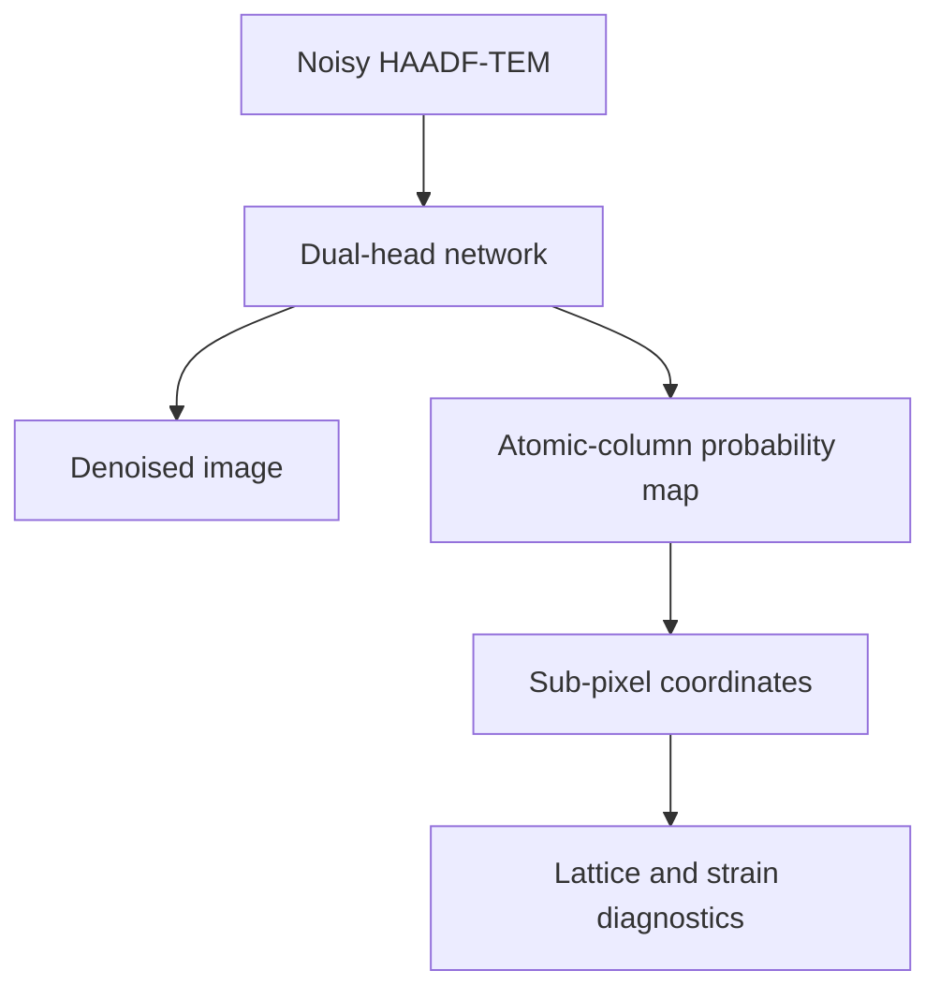

# Quantitative TEM with deep learning

Denoising, atomic-column segmentation, sub-pixel localization and lattice diagnostics on simulated HAADF-TEM, measured under one controlled protocol.

Four dual-head networks of comparable size are trained on identical folds of TEM-ImageNet-v1.3 and compared at two levels: the pixel-level output, and the atomic coordinates that output produces. The second level is the reason the repository exists. A reconstruction can score well in PSNR and still give a worse atomic mask, so segmentation, denoising, centroid recovery, shift recovery and strain are reported as separate measurements.

Status: active research codebase. The headline five-fold table is frozen at 14 September 2026 in [`tables/benchmark_summary.csv`](tables/benchmark_summary.csv). The [19 September run](runs/20260919-200658/) adds coordinate, runtime and stress-test output alongside it.



## Benchmark design

| Item | Specification |
|---|---|
| Data | 14,364 paired 256 x 256 simulated TEM frames, TEM-ImageNet-v1.3 |
| Models | AtomSegNet, U-Net++, HRNet, SwinUNet; about 9.1 M parameters each |
| Validation | Image-level 5-fold cross-validation, seed 42 |
| Headline evaluation | Deterministic 600-image subset per held-out fold, 3,000 evaluations per configuration |
| Training conditions | Direct training for all four models; N2V warm start for the three CNNs |
| Heads | Denoised intensity and atomic-column probability |
| Segmentation metric | IoU at a fixed probability threshold of 0.5 |
| Denoising metrics | PSNR and SSIM against the simulated clean frame, referenced to a Gaussian filter with sigma = 1 on the same noisy input |
| Downstream checks | Centroid recovery, controlled sub-pixel shifts, lattice fitting, exploratory strain |

## Segmentation and denoising

There is no single winner. AtomSegNet segments best; SwinUNet is the only model whose denoising head beats the Gaussian reference.

| Initialization | Model | IoU at 0.5 | PSNR (dB) | SSIM | PSNR vs Gaussian (dB) |
|---|---|---:|---:|---:|---:|
| Direct | AtomSegNet | 0.8763 ± 0.0026 | 24.68 ± 0.73 | 0.706 | -1.93 |
| Direct | HRNet | 0.8629 ± 0.0019 | 26.45 ± 0.34 | 0.801 | -0.16 |
| Direct | U-Net++ | 0.8601 ± 0.0071 | 18.13 ± 8.14 | 0.615 | -8.48 |
| Direct | SwinUNet | 0.8547 ± 0.0041 | 30.82 ± 0.35 | 0.917 | +4.21 |
| N2V warm start | AtomSegNet | 0.8616 ± 0.0018 | 20.98 ± 0.45 | 0.587 | -5.63 |
| N2V warm start | HRNet | 0.8248 ± 0.0064 | 15.82 ± 0.78 | 0.445 | -10.79 |
| N2V warm start | U-Net++ | 0.8604 ± 0.0101 | 15.17 ± 6.59 | 0.527 | -11.43 |

Values are mean ± sample standard deviation over five folds.


Direct AtomSegNet leads on IoU by 0.0134 over HRNet, 0.0162 over U-Net++ and 0.0216 over SwinUNet, and its fold spread is the tightest in the table at ± 0.0026. Direct SwinUNet gains 4.21 dB on the Gaussian reference and reaches SSIM 0.917, while every CNN denoising head sits at or below that reference. U-Net++ has the widest PSNR spread of any configuration, 8.14 dB direct and 6.59 dB with N2V, so its denoising head is fold-dependent in a way the others are not.

The N2V warm start does not transfer as a general gain. Mean IoU falls by 0.0147 for AtomSegNet and by 0.0381 for HRNet, and moves by 0.0003 for U-Net++. The cost on the denoising head is larger: 3.70 dB for AtomSegNet, 10.63 dB for HRNet and 2.96 dB for U-Net++. SwinUNet has direct folds only, so it is absent from the N2V half of the grid. Paired per-fold values and the protocol behind them are in [`docs/model-comparison.md`](docs/model-comparison.md).

## Model architectures

All four models emit a denoised image and an atomic-column map. They differ in how spatial information is routed.

| Model | Architecture |
|---|---|
| AtomSegNet | Five-level residual U-Net with attention-gated skip connections |
| U-Net++ (`UNetPP`) | Nested dense skip pathways with four learned deep-supervision branches |
| HRNet | Three parallel spatial resolutions with repeated cross-resolution fusion |
| SwinUNet | Hierarchical shifted-window transformer with patch merging and expansion |

The figures below are explanatory schematics. The executable definitions and instantiated hyperparameters in the training notebooks are the source of truth.

<details>
<summary><strong>AtomSegNet</strong>, residual attention U-Net</summary>


</details>

<details>
<summary><strong>U-Net++ / MT-UNet++</strong>, nested skip pathways and deep supervision</summary>


`MT-UNet++` is the schematic label for the dual-task `UNetPP` implementation in this repository.

</details>

<details>
<summary><strong>HRNet</strong>, parallel multi-resolution feature fusion</summary>


</details>

<details>
<summary><strong>SwinUNet</strong>, hierarchical shifted-window transformer</summary>


Benchmark instantiation: patch size 4, window size 8, embedding width 56, depths `(2, 2, 2, 2)`, attention heads `(2, 4, 8, 16)`. The schematic draws the same topology at a generic wider Swin profile.

</details>

## From masks to measurements

The analysis notebook turns probability maps into atomic-column centers and fits local lattice geometry from them. The 19 September run records this stage over four experiments, with all CSVs, nine figures and three comparison panels preserved in [`runs/20260919-200658/`](runs/20260919-200658/).

| Experiment | Result | Conditions |
|---|---|---|
| Atomic-center detection | Direct AtomSegNet F1 0.9476, matched-coordinate RMSE 1.322 px | 40 recorded frames, fold 2, 3 px match radius |
| Known fractional shifts | Direct AtomSegNet at dose 1000: median RMSE 0.273 px from raw images, 0.410 px from its own denoised images | 3 frames, 3 noise repeats, 8 shifts, row medians |
| Runtime at batch size 1 | Direct AtomSegNet 12.23 ms, direct SwinUNet 20.37 ms, median per image | Fold 2, one RTX 3070 Ti Laptop GPU |
| Synthetic perturbations | 5,040 recorded model/image/setting rows | 20 stems, 4 doses, 3 blur values, 3 tilt values, 7 settings |


Two results are worth reading together. AtomSegNet localizes better from the raw frame than from its own denoised frame, 0.273 px against 0.410 px, which is the opposite of what the PSNR table would predict, and it does so while running at 60 percent of SwinUNet's inference time. The model with the best image fidelity in the benchmark is therefore not the model that gives the best coordinates from it. Strain maps in this run are exploratory: imposed-deformation truth and a verified physical pixel calibration are not yet part of the protocol, and experimental TEM frames carry no ground-truth atom annotations.

The earlier controlled shift experiment stays in [`tables/`](tables/) for comparison. It used one configuration and five noise repeats; the 19 September experiment uses all seven settings and three repeats. Scope and interpretation for each are set out in [`docs/2026-09-19-supplementary-results.md`](docs/2026-09-19-supplementary-results.md).

## Repository map

| Path | Role |
|---|---|
| [`notebooks/01_cnn_training_pipeline.ipynb`](notebooks/01_cnn_training_pipeline.ipynb) | AtomSegNet, U-Net++ and HRNet training and evaluation |
| [`notebooks/02_swinunet_training.ipynb`](notebooks/02_swinunet_training.ipynb) | SwinUNet training record and five-fold direct run |
| [`notebooks/03_benchmark_and_physics.ipynb`](notebooks/03_benchmark_and_physics.ipynb) | Four-model benchmark and downstream physics analyses |
| [`tables/`](tables/) | Committed benchmark tables and provenance records |
| [`runs/20260919-200658/`](runs/20260919-200658/) | Follow-up run output: CSVs, nine figures, three comparison panels |
| [`assets/`](assets/) | Comparison figure, examples and architecture schematics |
| [`results/`](results/) | Earlier snapshot, retained for traceability |
| [`docs/methods.md`](docs/methods.md) | Metric definitions and interpretation rules |
| [`docs/model-comparison.md`](docs/model-comparison.md) | Protocol detail and paired N2V results |
| [`docs/reproducibility.md`](docs/reproducibility.md) | Environment, data and checkpoint layout, rerun levels |
| [`docs/2026-09-19-supplementary-results.md`](docs/2026-09-19-supplementary-results.md) | Scoped reading of the coordinate and perturbation results |
| [`docs/portfolio-blurb.md`](docs/portfolio-blurb.md) | Short descriptions for CVs and applications |
| [`scripts/plot_model_comparison.py`](scripts/plot_model_comparison.py) | Regenerates the comparison figure from the current CSV |
| [`scripts/summarize_supplementary_run.py`](scripts/summarize_supplementary_run.py) | Checks row counts and summarizes the committed follow-up CSVs |

## Quick start

The committed tables and figures can be inspected without the dataset or the model weights.

```bash
git clone https://github.com/akatsuki2bb/tem-atomic-localization-strain.git
cd tem-atomic-localization-strain

python -m venv .venv
source .venv/bin/activate        # Windows: .venv\Scripts\activate
pip install -r requirements.txt

python scripts/plot_model_comparison.py
python scripts/summarize_supplementary_run.py
```

## Running the full pipeline

Set the paths, then check the dataset before opening the analysis notebook.

```bash
export TEM_PROJECT_ROOT="$PWD"
export TEM_DATA_ROOT="/path/to/TEM-ImageNet-v1.3"
export TEM_RESULTS_ROOT="/path/to/checkpoints-and-run-records"
export TEM_REAL_DATA="/path/to/experimental-tifs"       # optional

python scripts/check_dataset.py
jupyter lab notebooks/03_benchmark_and_physics.ipynb
```

A full evaluation needs the TEM-ImageNet-v1.3 dataset and the 35 trained checkpoints, which are held outside the repository. The expected checkpoint layout, the environment and the three rerun levels are given in [`docs/reproducibility.md`](docs/reproducibility.md). Evaluation splits are reconstructed from the documented seed and basename order. The 19 September run is committed as output for inspection, and the weights behind it are external.

## Author

Utkarsh Upadhyay, IIT Jodhpur. Code and issues at [github.com/akatsuki2bb](https://github.com/akatsuki2bb).
