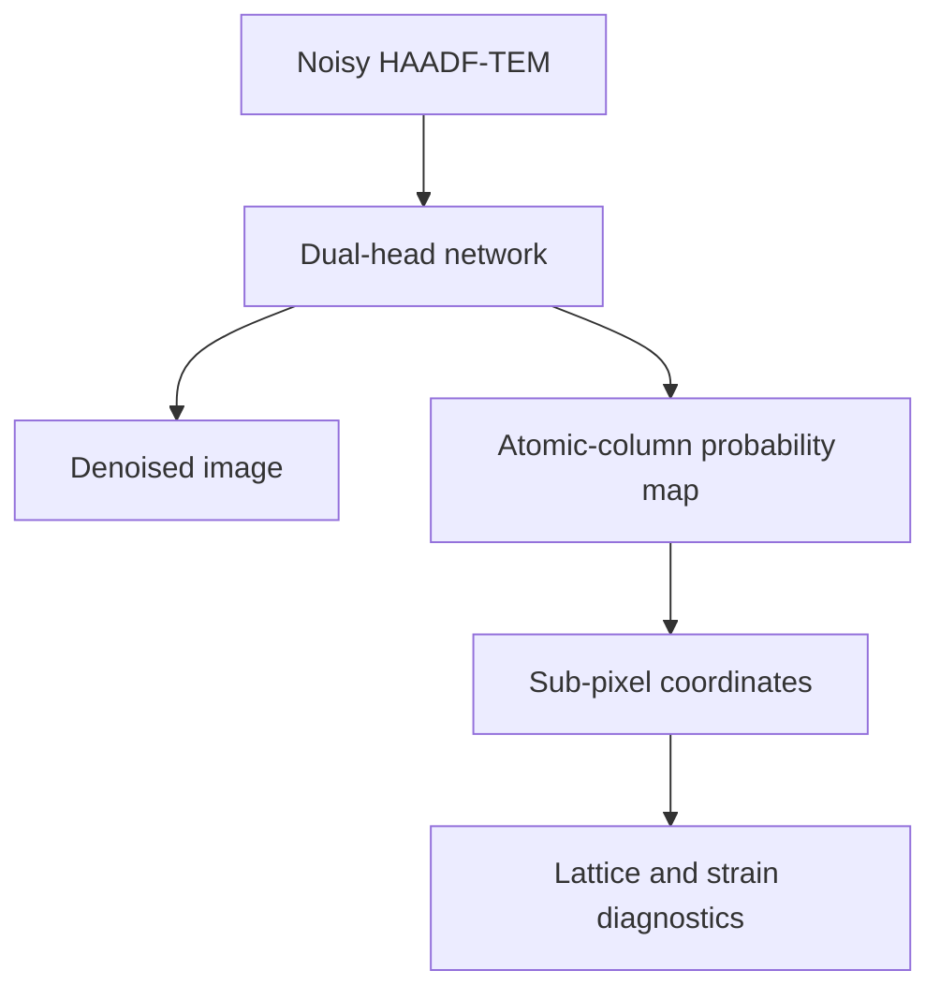
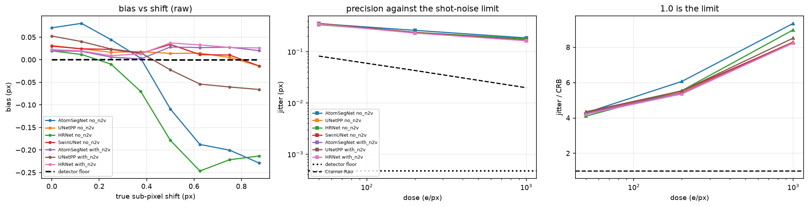
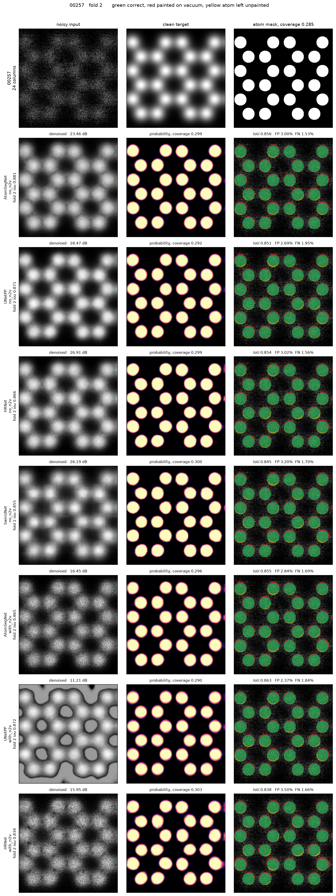
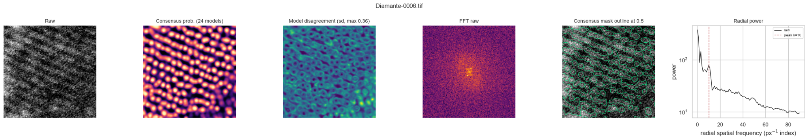

# Quantitative TEM with deep learning

Denoising, atomic-column segmentation, sub-pixel localization and lattice diagnostics on simulated HAADF-TEM, measured under one protocol.

We compare four dual-head networks of matched size, about 9.1 M parameters each, on 14,364 paired 256 x 256 frames from TEM-ImageNet-v1.3. The models take a noisy simulated frame and return a denoised image and an atomic-column probability map. The question is whether a model that reconstructs the image better also measures the lattice better. It does not: on five folds, direct SwinUNet gave the only denoising result above the Gaussian reference, at 30.82 dB, while direct AtomSegNet gave the highest segmentation IoU, 0.8763. Image fidelity and coordinate quality are therefore reported as separate measurements throughout this repository, and no single score is formed from them.

The headline comparison was frozen on 14 September 2026 in [`tables/benchmark_summary.csv`](tables/benchmark_summary.csv). A later run of 19 September 2026, archived complete in [`runs/20260919-200658/`](runs/20260919-200658/), adds coordinate accuracy, controlled shifts, a perturbation grid and device timings on one selected fold.



## Protocol

Five folds were generated with `KFold(n_splits=5, shuffle=True, random_state=42)` over the sorted paired basenames, and each fold was evaluated on a deterministic 600-image subset of its validation half, giving 3,000 evaluations per configuration. Segmentation was scored against `circularMask` at a fixed probability threshold of 0.5. Denoising was scored against `noNoise` and referenced to a Gaussian filter of sigma = 1 recomputed on the same inputs within each fold. Coordinates were matched to peaks taken from `gaussianMask`. AtomSegNet, U-Net++ and HRNet were each trained twice, directly and after a self-supervised Noise2Void warm start; SwinUNet has direct folds only. Definitions for every metric are in [`docs/methods.md`](docs/methods.md).

## Segmentation and denoising

| Condition | Model | Parameters (M) | IoU at 0.5 | Dice | PSNR (dB) | SSIM | Delta PSNR vs Gaussian (dB) |
|---|---|---:|---:|---:|---:|---:|---:|
| Direct | AtomSegNet | 9.121 | 0.8763 ± 0.0026 | 0.9330 | 24.68 ± 0.73 | 0.706 | -1.93 |
| Direct | HRNet | 9.181 | 0.8629 ± 0.0019 | 0.9249 | 26.45 ± 0.34 | 0.801 | -0.16 |
| Direct | U-Net++ | 9.118 | 0.8601 ± 0.0071 | 0.9236 | 18.13 ± 8.14 | 0.615 | -8.48 |
| Direct | SwinUNet | 9.272 | 0.8547 ± 0.0041 | 0.9199 | 30.82 ± 0.35 | 0.917 | +4.21 |
| N2V warm start | AtomSegNet | 9.121 | 0.8616 ± 0.0018 | 0.9244 | 20.98 ± 0.45 | 0.587 | -5.63 |
| N2V warm start | HRNet | 9.181 | 0.8248 ± 0.0064 | 0.9009 | 15.82 ± 0.78 | 0.445 | -10.79 |
| N2V warm start | U-Net++ | 9.118 | 0.8604 ± 0.0101 | 0.9236 | 15.17 ± 6.59 | 0.527 | -11.43 |

Values are means over five folds with the sample standard deviation.


Direct AtomSegNet led on IoU in every fold, by 0.0134 over HRNet (5/5 folds, 95 percent CI 0.0123 to 0.0145), 0.0162 over U-Net++ (5/5, CI 0.0126 to 0.0209) and 0.0216 over SwinUNet (5/5, CI 0.0182 to 0.0250). The four direct models span only 0.0216 in IoU, so the architectural effect on segmentation is small compared with the effect of the noise itself: with the clean frame supplied as input on fold 2, AtomSegNet rose from 0.8537 to 0.9013, and removing the simulated background as well took it to 0.9190 ([`tables/input_ablation.csv`](tables/input_ablation.csv)).

Denoising separates the models much further than segmentation does. Direct SwinUNet gained 4.21 dB on the Gaussian reference and reached SSIM 0.917, and its five folds agreed to within 0.35 dB. Every CNN denoising head sat at or below the Gaussian reference, so we do not present those heads as denoisers on this snapshot. U-Net++ was the least stable configuration in the table, with a fold spread of 8.14 dB direct and 6.59 dB after the warm start.
## Per-model qualitative strips and efficiency table


## Noise2Void warm start

The warm start was a self-supervised pass on the same noisy images, without labels, before supervised training. Paired across the five folds it reduced IoU for two of the three CNNs and left the third unchanged.

| Model | Mean delta IoU | Folds won by N2V | Paired p | Mean delta PSNR (dB) |
|---|---:|---:|---:|---:|
| AtomSegNet | -0.0147 | 0/5 | 4.9 x 10⁻⁶ | -3.70 |
| U-Net++ | +0.0003 | 3/5 | 0.945 | -2.95 |
| HRNet | -0.0382 | 0/5 | 6.0 x 10⁻⁵ | -10.63 |

The p-values come from five paired fold observations and are exploratory. The warm start also moved the coordinates: on the fold-2 localization table the mean bias magnitude of direct AtomSegNet was 0.360 px, and 0.702 px after the warm start, with the bias share of total error rising from 0.074 to 0.196. All 21 recorded paired contrasts are in [`runs/20260919-200658/tables/paired_differences.csv`](runs/20260919-200658/tables/paired_differences.csv), and the fold-level discussion is in [`docs/model-comparison.md`](docs/model-comparison.md).

## Cost

Timings are medians at batch size 1 on one RTX 3070 Ti Laptop GPU, fold 2.

| Direct model | GMACs | Latency (ms) | Throughput at batch 8 (img/s) | VRAM at batch 1 (MB) | IoU per GMAC |
|---|---:|---:|---:|---:|---:|
| SwinUNet | 2.82 | 20.37 | 263 | 116 | 0.303 |
| AtomSegNet | 18.01 | 12.23 | 163 | 177 | 0.049 |
| U-Net++ | 34.98 | 32.16 | 59 | 288 | 0.025 |
| HRNet | 106.14 | 49.26 | 12 | 641 | 0.008 |

Compute spans a factor of 37.7 across the four models and buys 0.0216 of IoU. HRNet costs 5.9 times the multiply-accumulates of AtomSegNet, four times the inference time and 3.6 times the memory, and segments 0.0134 worse. SwinUNet has the fewest GMACs because its attention runs on merged patches, yet it is slower than AtomSegNet at batch size 1, where kernel launches rather than arithmetic set the latency.

## Architectures

All four models emit a denoised image and an atomic-column map, and they differ in how spatial information is routed. AtomSegNet is a five-level residual U-Net with attention-gated skip connections. U-Net++ nests dense skip pathways and carries four deep-supervision branches. HRNet holds three spatial resolutions in parallel with repeated cross-resolution fusion. SwinUNet is a hierarchical shifted-window transformer with patch merging and expansion, instantiated here with patch size 4, window size 8, embedding width 56, depths (2, 2, 2, 2) and attention heads (2, 4, 8, 16). The schematics below are explanatory; the executable definitions in the training notebooks are the source of truth.

<details>
<summary>AtomSegNet, residual attention U-Net</summary>


</details>

<details>
<summary>U-Net++, nested skip pathways and deep supervision</summary>


`MT-UNet++` is the schematic label for the dual-task `UNetPP` implementation in this repository.

</details>

<details>
<summary>HRNet, parallel multi-resolution fusion</summary>


</details>

<details>
<summary>SwinUNet, hierarchical shifted-window transformer</summary>


Direct SwinUNet trained for 60 epochs on each of the five folds and ended at PSNR 30.19 to 30.54 dB and best F1 0.8917 to 0.8942, reached between epoch 57 and epoch 60 ([`runs/20260919-200658/tables/training_curves_summary.csv`](runs/20260919-200658/tables/training_curves_summary.csv)).

</details>

## From masks to coordinates

Local maxima of the probability map are refined to sub-pixel centers and matched to reference peaks within 3 px. The table below covers 40 frames of fold 2.

| Direct model | Detection F1 | Matched RMSE (px) | Bias magnitude (px) | Latency (ms) |
|---|---:|---:|---:|---:|
| AtomSegNet | 0.9476 | 1.322 | 0.360 | 12.23 |
| U-Net++ | 0.9308 | 1.392 | 0.405 | 32.16 |
| SwinUNet | 0.9174 | 1.377 | 0.302 | 20.37 |
| HRNet | 0.9067 | 1.405 | 0.347 | 49.26 |

The ordering here follows segmentation IoU rather than PSNR. SwinUNet reconstructs the intensity best by 4.2 dB and still detects fewer columns correctly than AtomSegNet, although its residual bias is the smallest of the four, at 0.302 px.



Known fractional-pixel translations of 0 to 0.875 px were applied before inference and removed afterwards, over three frames, three dose settings, three noise repeats and two coordinate sources. For direct AtomSegNet at dose 1000, the median residual RMSE was 0.273 px when coordinates were taken from the raw frame and 0.410 px when they were taken from the model's own denoised frame. The refinement itself is not what limits this: on noise-free inputs the same detector recovered the imposed shifts to within 0.017 px over 24 diagnostic rows ([`tables/detector_floor.csv`](tables/detector_floor.csv)). The 0.27 px figure is set by the noise and by what the network does to it, and denoising before fitting made the measurement worse, not better.

A grid of 5,040 evaluations over 20 image stems, four dose settings of 20 to 1000, three blur values and three tilt values records how segmentation responds to input perturbation. Direct AtomSegNet held IoU to within 0.009 between the highest and lowest dose, 0.8856 at dose 1000 and 0.8770 at dose 20, while direct SwinUNet lost 0.030 over the same interval, 0.8891 falling to 0.8589. The model with the best reconstruction is therefore also the most dose-sensitive segmenter in this grid. Tables and figures for this experiment are in [`runs/20260919-200658/tables/`](runs/20260919-200658/tables/) and [`runs/20260919-200658/figures/`](runs/20260919-200658/figures/).



## Lattice and strain diagnostics

Detected centers are fitted to a reference lattice, and the residual displacement field is propagated to local estimates of exx, eyy, exy and rotation over 60 dense frames per configuration from one fold. The pixel scale recorded in the run manifest, 0.1229 A/px, is not independently verified, so coordinate errors are quoted in pixels and the strain output is read as a demonstration of the fitted geometry. The experimental frames carry no atom labels, and transfer is therefore characterized by coverage, inter-model agreement and FFT lattice preservation: the direct models reached consensus coverage of 0.468 to 0.501 with 83 to 89 percent of lattice reflections preserved ([`results/transfer_by_arch.csv`](results/transfer_by_arch.csv)).



## Repository layout

| Path | Contents |
|---|---|
| [`notebooks/01_cnn_training_pipeline.ipynb`](notebooks/01_cnn_training_pipeline.ipynb) | AtomSegNet, U-Net++ and HRNet training and evaluation |
| [`notebooks/02_swinunet_training.ipynb`](notebooks/02_swinunet_training.ipynb) | SwinUNet training record, five direct folds |
| [`notebooks/03_benchmark_and_physics.ipynb`](notebooks/03_benchmark_and_physics.ipynb) | Four-model benchmark and the downstream physics analyses |
| [`tables/`](tables/) | Benchmark summary, centroid metrics, input ablation, detector floor, checkpoint inventory and per-checkpoint key lists |
| [`runs/20260919-200658/`](runs/20260919-200658/) | The 19 September run as supplied: 11 tables, nine figures, three panels, manifest and event log |
| [`assets/`](assets/) | Comparison figure, architecture schematics, segmentation, strain and transfer examples |
| [`results/`](results/) | Earlier per-fold localization, precision, strain and transfer output |
| [`docs/methods.md`](docs/methods.md) | Metric definitions and the rule against collapsing them |
| [`docs/model-comparison.md`](docs/model-comparison.md) | Paired fold statistics and the scope of each supporting table |
| [`docs/reproducibility.md`](docs/reproducibility.md) | Environment, checkpoint layout and the three rerun levels |
| [`docs/2026-09-19-supplementary-results.md`](docs/2026-09-19-supplementary-results.md) | Reading of the coordinate, perturbation and timing results |
| [`docs/portfolio-blurb.md`](docs/portfolio-blurb.md) | Short descriptions for applications |
| [`scripts/`](scripts/) | `check_dataset.py`, `plot_model_comparison.py` and `summarize_supplementary_run.py` |

## Reproduction

The committed tables and figures can be inspected without the dataset or the weights.

```bash
git clone https://github.com/akatsuki2bb/tem-atomic-localization-strain.git
cd tem-atomic-localization-strain

python -m venv .venv
source .venv/bin/activate        # Windows: .venv\Scripts\activate
pip install -r requirements.txt

python scripts/plot_model_comparison.py        # regenerates the comparison figure
python scripts/summarize_supplementary_run.py  # checks row counts, recomputes the quoted medians
```

Notebook execution needs the dataset and the 35 trained checkpoints, which are held outside the repository. Paths are read from the environment, and [`.env.example`](.env.example) lists them.

```bash
export TEM_PROJECT_ROOT="$PWD"
export TEM_DATA_ROOT="/path/to/TEM-ImageNet-v1.3"
export TEM_RESULTS_ROOT="/path/to/checkpoints-and-run-records"
export TEM_REAL_DATA="/path/to/experimental-tifs"       # optional

python scripts/check_dataset.py
jupyter lab notebooks/03_benchmark_and_physics.ipynb
```

The benchmark was run under Windows 11 with Python 3.14.2, PyTorch 2.11.0+cu128 and NumPy 2.5.1 on an RTX 3070 Ti Laptop GPU. A conda specification is in [`environment.yml`](environment.yml), the checkpoint layout and the dataset expectations are in [`docs/reproducibility.md`](docs/reproducibility.md) and [`data/README.md`](data/README.md).

## Citation

Upadhyay, U. Quantitative TEM with deep learning: a five-fold comparison of denoising, atomic-column segmentation and coordinate recovery on simulated HAADF-TEM. 2026. https://github.com/akatsuki2bb/tem-atomic-localization-strain

Questions and corrections are welcome through the issue tracker.
