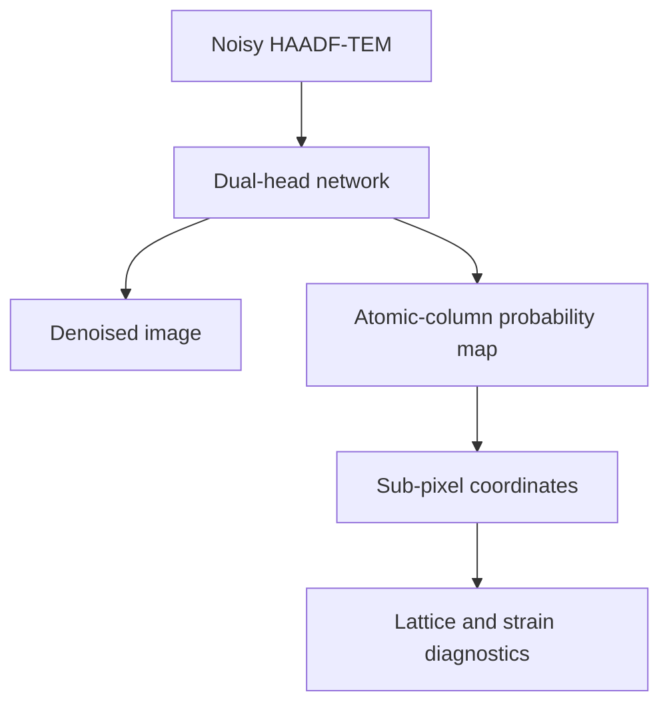
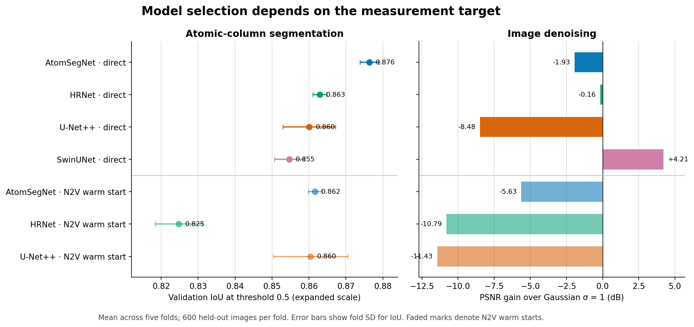
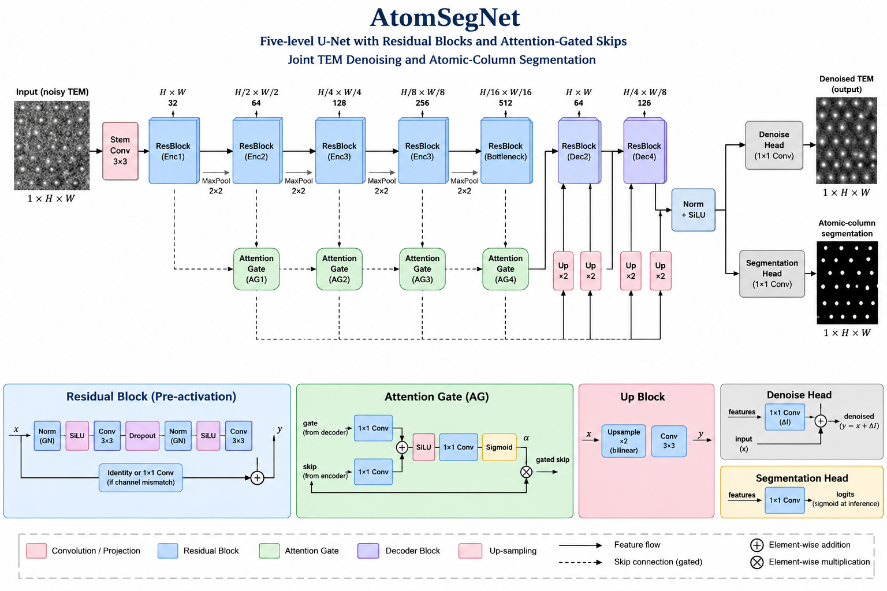
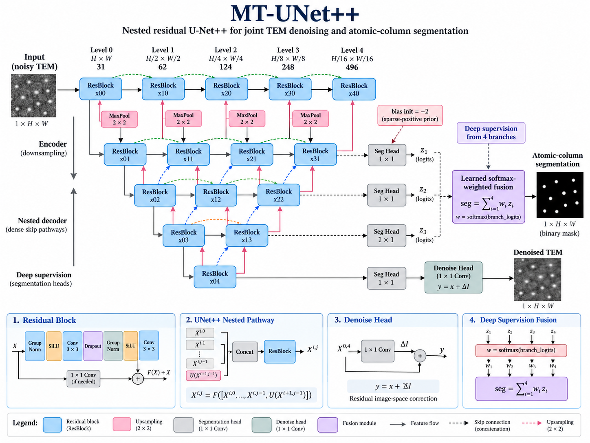
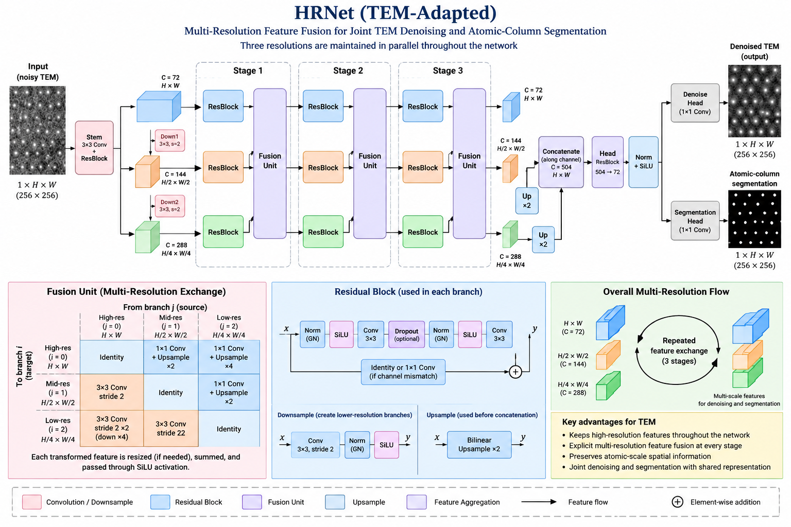
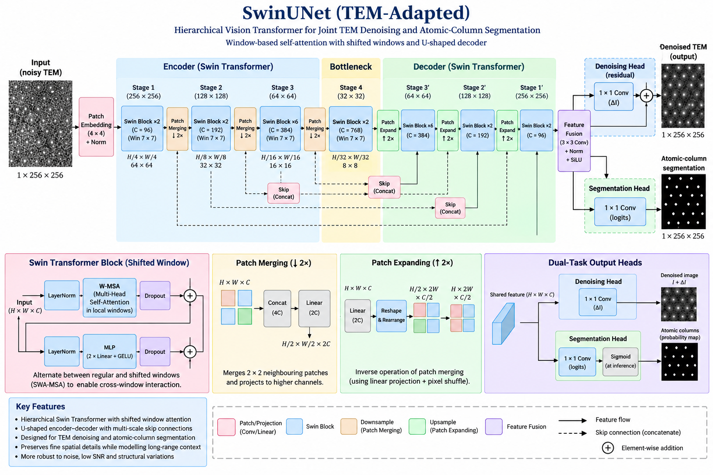

# Quantitative TEM with Deep Learning

**A controlled benchmark of denoising, atomic-column segmentation, sub-pixel localization, and lattice/strain diagnostics in simulated HAADF-TEM.**

This project asks a measurement question: **do cleaner-looking neural-network outputs also produce better atomic coordinates?** Four similarly sized models are compared, and their pixel-level outputs are propagated into coordinate and lattice analyses rather than judged by visual quality alone.



> Latest benchmark snapshot: **14 September 2026**. Headline values come from [`tables/benchmark_summary.csv`](tables/benchmark_summary.csv), not the earlier files under `results/`.

## Study design

| Item | Current scope |
|---|---|
| Data | 14,364 paired 256 × 256 simulated TEM frames from TEM-ImageNet-v1.3 |
| Models | AtomSegNet, U-Net++, HRNet, and SwinUNet; approximately 9.1 M parameters each |
| Validation | 5-fold image-level cross-validation, seed 42 |
| Headline evaluation | Deterministic subset of 600 held-out images per fold; 3,000 evaluations per configuration |
| Training conditions | Direct training for all four models; N2V warm start for the three CNN models |
| Primary outputs | Denoised intensity and atomic-column probability map |
| Downstream checks | Centroid recovery, controlled sub-pixel shifts, lattice fitting, and exploratory strain analysis |

## Main result

The models do **not** have one universal ranking. AtomSegNet gives the strongest segmentation, while SwinUNet gives the only denoising result that clearly beats the Gaussian reference.

| Initialization | Model | IoU at 0.5 | PSNR (dB) | SSIM | PSNR vs Gaussian (dB) |
|---|---|---:|---:|---:|---:|
| Direct | AtomSegNet | **0.8763 ± 0.0026** | 24.68 ± 0.73 | 0.706 | -1.93 |
| Direct | HRNet | 0.8629 ± 0.0019 | 26.45 ± 0.34 | 0.801 | -0.16 |
| Direct | U-Net++ | 0.8601 ± 0.0071 | 18.13 ± 8.14 | 0.615 | -8.48 |
| Direct | SwinUNet | 0.8547 ± 0.0041 | **30.82 ± 0.35** | **0.917** | **+4.21** |
| N2V warm start | AtomSegNet | 0.8616 ± 0.0018 | 20.98 ± 0.45 | 0.587 | -5.63 |
| N2V warm start | HRNet | 0.8248 ± 0.0064 | 15.82 ± 0.78 | 0.445 | -10.79 |
| N2V warm start | U-Net++ | 0.8604 ± 0.0101 | 15.17 ± 6.59 | 0.527 | -11.43 |

Values are mean ± sample standard deviation across five folds. IoU uses a fixed probability threshold of 0.5. PSNR and SSIM compare the denoising head with the simulated clean image; the reference is a Gaussian filter with σ = 1 applied to the same noisy inputs.



The defensible conclusions are narrow:

- **AtomSegNet, trained directly, is the best segmenter in this benchmark.** Its mean IoU is 0.0134 above direct HRNet, 0.0162 above direct U-Net++, and 0.0216 above direct SwinUNet.
- **SwinUNet, trained directly, is the best denoiser.** It gains 4.21 dB over the Gaussian reference, while every CNN denoising head falls at or below that baseline.
- **N2V is not a general improvement.** Paired across folds, it reduces IoU for AtomSegNet and HRNet and leaves U-Net++ effectively unchanged. SwinUNet has not been evaluated with N2V.
- **Image fidelity is not coordinate quality.** The repository therefore keeps segmentation, denoising, centroid, shift-recovery, and strain diagnostics separate.

See [`docs/model-comparison.md`](docs/model-comparison.md) for protocol details, paired N2V results, and the scope of the downstream tests.

## Model architectures

All four models produce a denoised image and an atomic-column segmentation map, but they route spatial information differently.

| Model | Main architectural idea |
|---|---|
| AtomSegNet | Five-level residual U-Net with attention-gated skip connections |
| U-Net++ (`UNetPP`) | Nested dense skip pathways with four learned deep-supervision branches |
| HRNet | Three parallel spatial resolutions with repeated cross-resolution fusion |
| SwinUNet | Hierarchical shifted-window transformer with patch merging and expansion |

The figures below are explanatory schematics. The executable definitions and instantiated hyperparameters in the training notebooks remain the source of truth.

<details>
<summary><strong>AtomSegNet</strong> — residual attention U-Net</summary>



</details>

<details>
<summary><strong>U-Net++ / MT-UNet++</strong> — nested skip pathways and deep supervision</summary>



`MT-UNet++` is the schematic label for the repository's dual-task `UNetPP` implementation.

</details>

<details>
<summary><strong>HRNet</strong> — parallel multi-resolution feature fusion</summary>



</details>

<details>
<summary><strong>SwinUNet</strong> — hierarchical shifted-window transformer</summary>



Benchmark instantiation: patch size 4, window size 8, embedding width 56, depths `(2, 2, 2, 2)`, and attention heads `(2, 4, 8, 16)`. The schematic illustrates the same topology with a generic wider Swin profile.

</details>

## From masks to measurements

The analysis notebook converts probability maps into atomic-column centers and then fits local lattice geometry. The current downstream evidence is deliberately labelled as supporting analysis:

- the controlled shift experiment uses three frames, three simulated dose levels, five noise realizations, and eight sub-pixel shifts;
- the lattice/strain batch uses 60 dense frames per configuration from one selected fold;
- physical pixel calibration is not verified, so spatial claims should remain in **pixels**;
- experimental TEM frames are unlabeled, so transfer outputs are qualitative diagnostics rather than accuracy measurements.

This separation is the core research contribution: a reconstruction can look convincing or score well in PSNR while producing a worse atomic mask, and stable coordinates on selected frames do not by themselves establish strain accuracy.

## Repository map

| Path | Role |
|---|---|
| [`notebooks/01_cnn_training_pipeline.ipynb`](notebooks/01_cnn_training_pipeline.ipynb) | AtomSegNet, U-Net++, and HRNet training/evaluation pipeline |
| [`notebooks/02_swinunet_training.ipynb`](notebooks/02_swinunet_training.ipynb) | SwinUNet training record and five-fold direct-training run |
| [`notebooks/03_benchmark_and_physics.ipynb`](notebooks/03_benchmark_and_physics.ipynb) | Current four-model benchmark and downstream physics analyses |
| [`tables/`](tables/) | Current committed benchmark tables and provenance records |
| [`assets/`](assets/) | Model-comparison figure, examples, and architecture schematics |
| [`results/`](results/) | Earlier, incomplete snapshot retained for traceability |
| [`docs/methods.md`](docs/methods.md) | Evaluation definitions and interpretation rules |
| [`docs/reproducibility.md`](docs/reproducibility.md) | Environment, data/checkpoint requirements, and rerun levels |
| [`docs/portfolio-blurb.md`](docs/portfolio-blurb.md) | Short descriptions for CVs and PhD applications |
| [`scripts/plot_model_comparison.py`](scripts/plot_model_comparison.py) | Regenerates the README comparison figure from the current CSV |

## Quick start

The committed tables and figure can be inspected without the dataset or model weights.

```bash
git clone https://github.com/akatsuki2bb/tem-atomic-localization-strain.git
cd tem-atomic-localization-strain

python -m venv .venv
source .venv/bin/activate        # Windows: .venv\Scripts\activate
pip install -r requirements.txt

python scripts/plot_model_comparison.py
```

For dataset checks and notebook execution, set the paths first:

```bash
export TEM_PROJECT_ROOT="$PWD"
export TEM_DATA_ROOT="/path/to/TEM-ImageNet-v1.3"
export TEM_RESULTS_ROOT="/path/to/checkpoints-and-run-records"
export TEM_REAL_DATA="/path/to/experimental-tifs"       # optional

python scripts/check_dataset.py
jupyter lab notebooks/03_benchmark_and_physics.ipynb
```

Full evaluation requires the external dataset and 35 trained checkpoints; they are not committed here. Exact requirements and the expected checkpoint layout are documented in [`docs/reproducibility.md`](docs/reproducibility.md).

## Limits that matter

- The headline table evaluates 600 images per fold rather than each complete validation fold.
- Folds are image-level KFold splits. Related simulation-family frames may therefore occur on both sides of a split.
- The evaluation split is reconstructed from the documented seed and basename order; the CNN checkpoints do not embed enough metadata to verify it mechanically.
- N2V pretraining saw noisy images that later appeared in validation folds, although it did not see their labels.
- Checkpoints, the full dataset, and experimental images are external to this repository.
- The downstream localization and strain experiments are smaller than the segmentation benchmark and should not be read as a calibrated strain-validation study.
- Experimental transfer has no ground-truth atom annotations.

This is an **ongoing research codebase**, not a production microscopy package. The present repository supports a credible model-comparison and methods narrative; a publication-grade release still needs group-aware splits, full-fold evaluation, archived checkpoints/configuration, and deformation-ground-truth strain tests.
