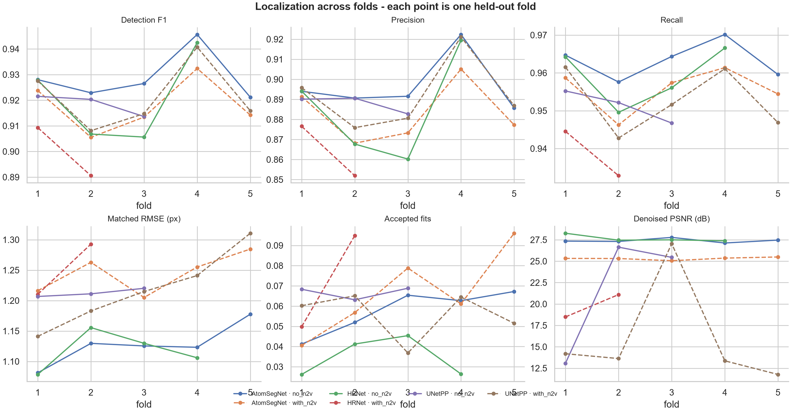

# Localization across all available folds

Folds evaluated: 24  |  images per fold: 100  |  match gate: 3 px  |  threshold: 0.50

| Condition | Arch | Folds | F1 | Precision | Recall | RMSE (px) | Accepted fits |
|---|---|---:|---|---|---|---|---|
| no_n2v | AtomSegNet | 5 | 0.929 ± 0.010 | 0.897 ± 0.015 | 0.963 ± 0.005 | 1.13 ± 0.03 | 0.058 ± 0.011 |
| no_n2v | HRNet | 4 | 0.921 ± 0.018 | 0.885 ± 0.027 | 0.959 ± 0.008 | 1.12 ± 0.03 | 0.035 ± 0.010 |
| no_n2v | UNetPP | 3 | 0.918 ± 0.004 | 0.888 ± 0.004 | 0.951 ± 0.004 | 1.21 ± 0.01 | 0.067 ± 0.003 |
| with_n2v | AtomSegNet | 5 | 0.918 ± 0.010 | 0.883 ± 0.015 | 0.956 ± 0.006 | 1.24 ± 0.03 | 0.067 ± 0.021 |
| with_n2v | HRNet | 2 | 0.900 ± 0.013 | 0.864 ± 0.017 | 0.939 ± 0.008 | 1.25 ± 0.06 | 0.072 ± 0.032 |
| with_n2v | UNetPP | 5 | 0.921 ± 0.013 | 0.892 ± 0.018 | 0.953 ± 0.008 | 1.22 ± 0.06 | 0.056 ± 0.012 |

## Per fold

| Condition | Arch | Fold | Images | Detections | F1 | RMSE (px) | Accepted fits |
|---|---|---:|---:|---:|---|---|---|
| no_n2v | AtomSegNet | 1 | 100 | 7181 | 0.928 | 1.08 | 0.041 |
| no_n2v | AtomSegNet | 2 | 100 | 7123 | 0.923 | 1.13 | 0.052 |
| no_n2v | AtomSegNet | 3 | 100 | 7312 | 0.927 | 1.13 | 0.065 |
| no_n2v | AtomSegNet | 4 | 100 | 7083 | 0.946 | 1.12 | 0.063 |
| no_n2v | AtomSegNet | 5 | 100 | 7156 | 0.921 | 1.18 | 0.067 |
| no_n2v | HRNet | 1 | 100 | 7177 | 0.928 | 1.08 | 0.026 |
| no_n2v | HRNet | 2 | 100 | 7250 | 0.907 | 1.16 | 0.041 |
| no_n2v | HRNet | 3 | 100 | 7513 | 0.906 | 1.13 | 0.045 |
| no_n2v | HRNet | 4 | 100 | 7079 | 0.942 | 1.11 | 0.026 |
| no_n2v | UNetPP | 1 | 100 | 7142 | 0.922 | 1.21 | 0.068 |
| no_n2v | UNetPP | 2 | 100 | 7083 | 0.920 | 1.21 | 0.063 |
| no_n2v | UNetPP | 3 | 100 | 7250 | 0.914 | 1.22 | 0.069 |
| with_n2v | AtomSegNet | 1 | 100 | 7158 | 0.924 | 1.22 | 0.041 |
| with_n2v | AtomSegNet | 2 | 100 | 7221 | 0.906 | 1.26 | 0.057 |
| with_n2v | AtomSegNet | 3 | 100 | 7411 | 0.913 | 1.21 | 0.079 |
| with_n2v | AtomSegNet | 4 | 100 | 7153 | 0.932 | 1.26 | 0.061 |
| with_n2v | AtomSegNet | 5 | 100 | 7186 | 0.914 | 1.28 | 0.096 |
| with_n2v | HRNet | 1 | 100 | 7171 | 0.909 | 1.21 | 0.050 |
| with_n2v | HRNet | 2 | 100 | 7254 | 0.891 | 1.29 | 0.095 |
| with_n2v | UNetPP | 1 | 100 | 7143 | 0.928 | 1.14 | 0.060 |
| with_n2v | UNetPP | 2 | 100 | 7131 | 0.908 | 1.18 | 0.065 |
| with_n2v | UNetPP | 3 | 100 | 7305 | 0.915 | 1.21 | 0.037 |
| with_n2v | UNetPP | 4 | 100 | 7026 | 0.941 | 1.24 | 0.064 |
| with_n2v | UNetPP | 5 | 100 | 7052 | 0.916 | 1.31 | 0.051 |

## Interpretation

- The spread across folds is the fold-to-fold variability of a single CV sweep, not a confidence interval on a population.
- Every fold is a held-out validation split, not an independent test set.
- Reference centres come from markers unless a verified coordinate input was supplied; see each fold's summary JSON for its source.
- Position RMSE is conditional on a gated match, so it must be read alongside precision and recall.

